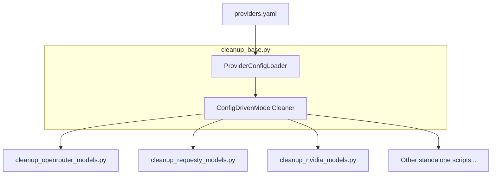

# Refactoring Plan: Standalone Cleanup Scripts to Use providers.yaml

## Executive Summary

The standalone cleanup scripts (e.g., `cleanup_openrouter_models.py`, `cleanup_requesty_models.py`) currently duplicate configuration values that already exist in `providers.yaml`. This plan proposes refactoring these scripts to leverage the centralized provider configuration, reducing code duplication and improving maintainability.

## Current State Analysis

### Duplication Identified

Each standalone script currently hardcodes provider-specific values:

| Script | Duplicated Values |
|--------|-------------------|
| `cleanup_openrouter_models.py` | `API_URL`, `EMBEDDINGS_API_URL`, `MODEL_PREFIX`, `SPECIAL_MODELS`, `PROVIDER_ORDER` |
| `cleanup_requesty_models.py` | `API_URL`, `MODEL_PREFIX`, `API_BASE_PATTERN`, `SPECIAL_MODELS`, `PROVIDER_ORDER` |
| `cleanup_nvidia_models.py` | `API_URL`, `MODEL_PREFIX`, `FREE_MODEL_COST`, `PROVIDER_ORDER` |
| `cleanup_vercel_models.py` | `API_URL`, `MODEL_PREFIX`, `PROVIDER_ORDER` |
| `cleanup_poe_models.py` | `API_URL`, `MODEL_PREFIX`, `API_BASE_PATTERN`, `SPECIAL_MODELS`, `PROVIDER_ORDER` |
| `cleanup_nano_gpt_models.py` | `API_URL`, `MODEL_PREFIX`, `API_BASE_PATTERN`, `SPECIAL_MODELS`, `PROVIDER_ORDER` |
| `cleanup_synthetic_models.py` | `API_URL`, `MODEL_PREFIX`, `SPECIAL_MODELS`, `PROVIDER_ORDER` |
| `cleanup_novita_models.py` | `API_URL`, `MODEL_PREFIX`, `PROVIDER_ORDER` |

### Already in providers.yaml

The `providers.yaml` file already contains all the necessary configuration for each provider:
- `api_url` - API endpoint URL
- `embeddings_api_url` - Embeddings API endpoint (where applicable)
- `model_prefix` - LiteLLM model prefix
- `model_detection` - How to identify models (prefix or api_base detection)
- `pricing` - How to parse pricing from API response
- `model_name_prefix` - Prefix for generated model names
- `model_name_cleanup` - Rules for cleaning up model names
- `special_models` - Models to exclude from validation
- `api_base_config` - API base URL configuration
- `api_key_env` - Environment variable for API key
- `order` - Provider priority order

## Proposed Solution Architecture

### Approach: Config-Driven BaseModelCleaner

The solution involves:

1. **Enhance `cleanup_base.py`** with a shared provider configuration loader
2. **Create a new `ConfigDrivenModelCleaner` class** that reads configuration from `providers.yaml`
3. **Simplify standalone scripts** to minimal provider-specific overrides only



### Key Design Decisions

#### 1. Provider Configuration Loader in cleanup_base.py

Add a `ProviderConfigLoader` class to `cleanup_base.py` that:
- Loads `providers.yaml` once (singleton pattern)
- Provides access to provider configuration by name
- Handles validation and error reporting

#### 2. ConfigDrivenModelCleaner Base Class

A new abstract class that:
- Takes `provider_name` as constructor parameter
- Automatically loads configuration from `providers.yaml`
- Implements common methods based on configuration
- Reduces per-provider implementation to:
  - `fetch_available_models()` - API response parsing varies by provider
  - Provider-specific business logic (e.g., OpenRouter free variants)

#### 3. Simplified Standalone Scripts

Each standalone script will:
- Specify only the provider name
- Override only truly provider-specific logic
- Delegate all configuration to `providers.yaml`

### Implementation Classes

```python
# In cleanup_base.py

class ProviderConfigLoader:
    """Singleton loader for provider configuration."""
    _instance = None
    _config = None
    
    @classmethod
    def get_config(cls, provider_name: str) -> Dict[str, Any]:
        """Get configuration for a specific provider."""
        ...

class ConfigDrivenModelCleaner(BaseModelCleaner):
    """Base class for config-driven model cleaners."""
    
    def __init__(self, provider_name: str, config_path: str, 
                 dry_run: bool = False, verbose: bool = False):
        # Load provider config from providers.yaml
        self.provider_config = ProviderConfigLoader.get_config(provider_name)
        
        # Set attributes from config
        self.PROVIDER_NAME = self.provider_config['name']
        self.API_URL = self.provider_config['api_url']
        self.MODEL_PREFIX = self.provider_config['model_prefix']
        self.SPECIAL_MODELS = set(self.provider_config.get('special_models', []))
        self.PROVIDER_ORDER = self.provider_config.get('order', 2)
        ...
```

## Before and After Comparison

### Before (cleanup_nvidia_models.py - 192 lines)

```python
NVIDIA_API_URL = "https://integrate.api.nvidia.com/v1/models"
FREE_MODEL_COST = 1.0e-09

class NvidiaModelCleaner(BaseModelCleaner):
    PROVIDER_NAME = "Nvidia"
    API_URL = NVIDIA_API_URL
    MODEL_PREFIX = "nvidia_nim/"
    PROVIDER_ORDER = 2
    
    def extract_provider_models(self, config):
        # 20+ lines of boilerplate
        ...
    
    def fetch_available_models(self):
        # Provider-specific API parsing
        ...
    
    def get_api_model_id(self, model_id):
        return model_id.replace(self.MODEL_PREFIX, '')
    
    def generate_model_name(self, model_id, prefix="nim-"):
        return super().generate_model_name(model_id, prefix)
    
    def create_model_entry(self, model_id, api_model_info, model_name):
        # Provider-specific entry creation
        ...
    
    def run_cleanup(self, add_models=None, custom_model_name=None):
        # 50+ lines of common cleanup logic
        ...
```

### After (cleanup_nvidia_models.py - ~60 lines)

```python
from cleanup_base import ConfigDrivenModelCleaner, setup_common_args, validate_model_name_arg

class NvidiaModelCleaner(ConfigDrivenModelCleaner):
    """Cleaner for Nvidia NIM models."""
    
    def __init__(self, config_path: str, dry_run: bool = False, verbose: bool = False):
        super().__init__('nvidia', config_path, dry_run, verbose)
    
    def parse_api_pricing(self, model: Dict[str, Any]) -> Dict[str, Any]:
        """Override: Nvidia models are free."""
        return {
            'id': model['id'],
            'input_cost': self.provider_config['pricing'].get('default_cost', 1e-09),
            'output_cost': self.provider_config['pricing'].get('default_cost', 1e-09),
        }

def main():
    parser = argparse.ArgumentParser(
        description='Validate and cleanup Nvidia NIM models in LiteLLM config'
    )
    setup_common_args(parser)
    args = parser.parse_args()
    validate_model_name_arg(args, parser)
    
    cleaner = NvidiaModelCleaner(
        config_path=args.config,
        dry_run=args.dry_run,
        verbose=args.verbose
    )
    return cleaner.run_cleanup(add_models=args.add_model, custom_model_name=args.model_name)

if __name__ == "__main__":
    sys.exit(main())
```

## Implementation Plan

### Phase 1: Enhance cleanup_base.py

1. Add `ProviderConfigLoader` class with singleton pattern
2. Add `ConfigDrivenModelCleaner` base class with:
   - Config-driven initialization
   - Generic `extract_provider_models()` based on detection type
   - Generic `get_api_model_id()` 
   - Generic `generate_model_name()` using config
   - Generic `create_model_entry()` using config
   - Common `run_cleanup()` implementation
   - Abstract `parse_api_pricing()` for provider-specific parsing

### Phase 2: Add Missing Provider to providers.yaml

1. Add `novita` provider configuration to `providers.yaml`

### Phase 3: Refactor Each Standalone Script

For each script, the pattern is:
1. Import `ConfigDrivenModelCleaner` instead of `BaseModelCleaner`
2. Remove all hardcoded constants
3. Keep only provider-specific logic (mainly API response parsing)
4. Simplify `main()` function

Order of refactoring (by complexity):
1. `cleanup_nvidia_models.py` - Simplest (free models, no special handling)
2. `cleanup_novita_models.py` - Simple with unique pricing format
3. `cleanup_vercel_models.py` - Simple prefix detection
4. `cleanup_poe_models.py` - api_base detection
5. `cleanup_requesty_models.py` - api_base detection with special models
6. `cleanup_nano_gpt_models.py` - api_base detection with per-million pricing
7. `cleanup_synthetic_models.py` - api_base detection with special models
8. `cleanup_openrouter_models.py` - Most complex (free variants, embeddings)

### Phase 4: Testing and Validation

1. Run each refactored script with `--dry-run` to verify behavior
2. Compare output with original scripts
3. Run actual cleanup on test config files

## Provider-Specific Considerations

### OpenRouter
- Has unique free variant handling (`:free` suffix)
- Separate embeddings API endpoint
- Most complex, may need additional methods

### Requesty
- Uses api_base detection
- Has special model (`smart-task`)
- Pricing uses `input_price`/`output_price` fields

### Nvidia
- All models are free (default_cost in config)
- Uses prefix detection
- No pricing fields in API response

### Nano-GPT
- Uses api_base detection with env var (`NANOGPT_API_BASE`)
- Pricing is per million tokens (requires conversion)

### Poe
- Uses api_base detection
- Pricing uses `pricing.prompt`/`pricing.completion`

### Vercel
- Uses prefix detection
- Pricing uses `pricing.input`/`pricing.output`

### Synthetic
- Uses api_base detection with env var (`SYNTHETIC_API_BASE`)  
- Has special model for embeddings
- Pricing uses `pricing.prompt`/`pricing.completion`

### Novita
- Uses prefix detection
- Unique pricing format: `input_token_price_per_m` (credits per million)
- Requires conversion: `price / 10000 / 1_000_000`

## Benefits of This Refactoring

1. **Single Source of Truth**: All provider configuration in `providers.yaml`
2. **Reduced Code Duplication**: ~70% reduction in standalone script size
3. **Easier Maintenance**: Change configuration without touching code
4. **Consistency**: All scripts behave consistently
5. **Easier to Add New Providers**: Just add config and minimal script

## Risks and Mitigations

| Risk | Mitigation |
|------|------------|
| Behavioral differences after refactoring | Comprehensive `--dry-run` testing before and after |
| Breaking existing scripts | Phased rollout, one script at a time |
| Complex provider logic hard to generalize | Keep provider-specific logic in overridable methods |
| Config format changes | Validate config schema at load time |

## Files to Modify

1. **Create/Modify**:
   - `cleanup_base.py` - Add `ProviderConfigLoader` and `ConfigDrivenModelCleaner`
   - `providers.yaml` - Add novita provider configuration

2. **Refactor**:
   - `cleanup_openrouter_models.py`
   - `cleanup_requesty_models.py`
   - `cleanup_nvidia_models.py`
   - `cleanup_vercel_models.py`
   - `cleanup_poe_models.py`
   - `cleanup_nano_gpt_models.py`
   - `cleanup_synthetic_models.py`
   - `cleanup_novita_models.py`

3. **No Changes**:
   - `cleanup_models.py` - Already uses `providers.yaml` (unified script)
